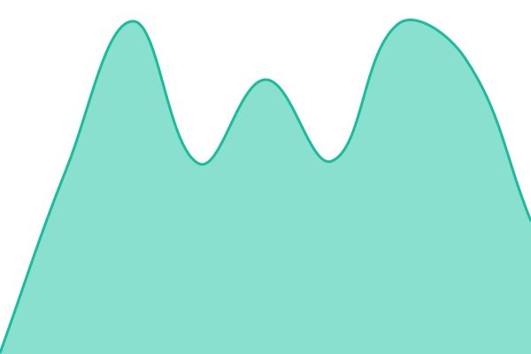
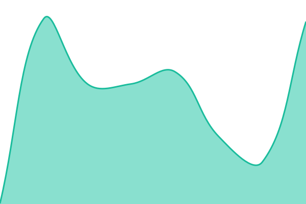

# [📈 Live Status](https://status.screenshotline.com): <!--live status--> **🟩 All systems operational**

This repository contains the open-source uptime monitor and status page for [M.A. Mubeen Khan](https://status.screenshotline.com), powered by [Upptime](https://github.com/upptime/upptime).

With [Upptime](https://upptime.js.org), you can get your own unlimited and free uptime monitor and status page, powered entirely by a GitHub repository. We use [Issues](https://github.com/MAMubeenKhan/screenshotline-status/issues) as incident reports, [Actions](https://github.com/MAMubeenKhan/screenshotline-status/actions) as uptime monitors, and [Pages](https://status.screenshotline.com) for the status page.

<!--start: status pages-->
<!-- This summary is generated by Upptime (https://github.com/upptime/upptime) -->
<!-- Do not edit this manually, your changes will be overwritten -->
<!-- prettier-ignore -->
| URL | Status | History | Response Time | Uptime |
| --- | ------ | ------- | ------------- | ------ |
|  [Website](https://screenshotline.com) | 🟩 Up | [website.yml](https://github.com/MAMubeenKhan/screenshotline-status/commits/HEAD/history/website.yml) | 

 293ms
     
 | 

<a href="https://status.screenshotline.com/history/website">100.00%</a>
    

|  [Screenshot rendering](https://screenshotline.com/healthz/render) | 🟩 Up | [screenshot-rendering.yml](https://github.com/MAMubeenKhan/screenshotline-status/commits/HEAD/history/screenshot-rendering.yml) | 

 2599ms
     
 | 

<a href="https://status.screenshotline.com/history/screenshot-rendering">100.00%</a>
    

|  [API](https://api.screenshotline.com/take?url=example.com) | 🟩 Up | [api.yml](https://github.com/MAMubeenKhan/screenshotline-status/commits/HEAD/history/api.yml) | 

 212ms
     
 | 

<a href="https://status.screenshotline.com/history/api">100.00%</a>
    

|  [MCP server](https://api.screenshotline.com/mcp) | 🟩 Up | [mcp-server.yml](https://github.com/MAMubeenKhan/screenshotline-status/commits/HEAD/history/mcp-server.yml) | 

 167ms
     
 | 

<a href="https://status.screenshotline.com/history/mcp-server">100.00%</a>
    

<!--end: status pages-->

[**Visit our status website →**](https://status.screenshotline.com)

## 📄 License

- Powered by: [Upptime](https://github.com/upptime/upptime)
- Code: [MIT](./LICENSE) © [Anand Chowdhary](https://anandchowdhary.com)
- Data in the `./history` directory: [Open Database License](https://opendatacommons.org/licenses/odbl/1-0/)
